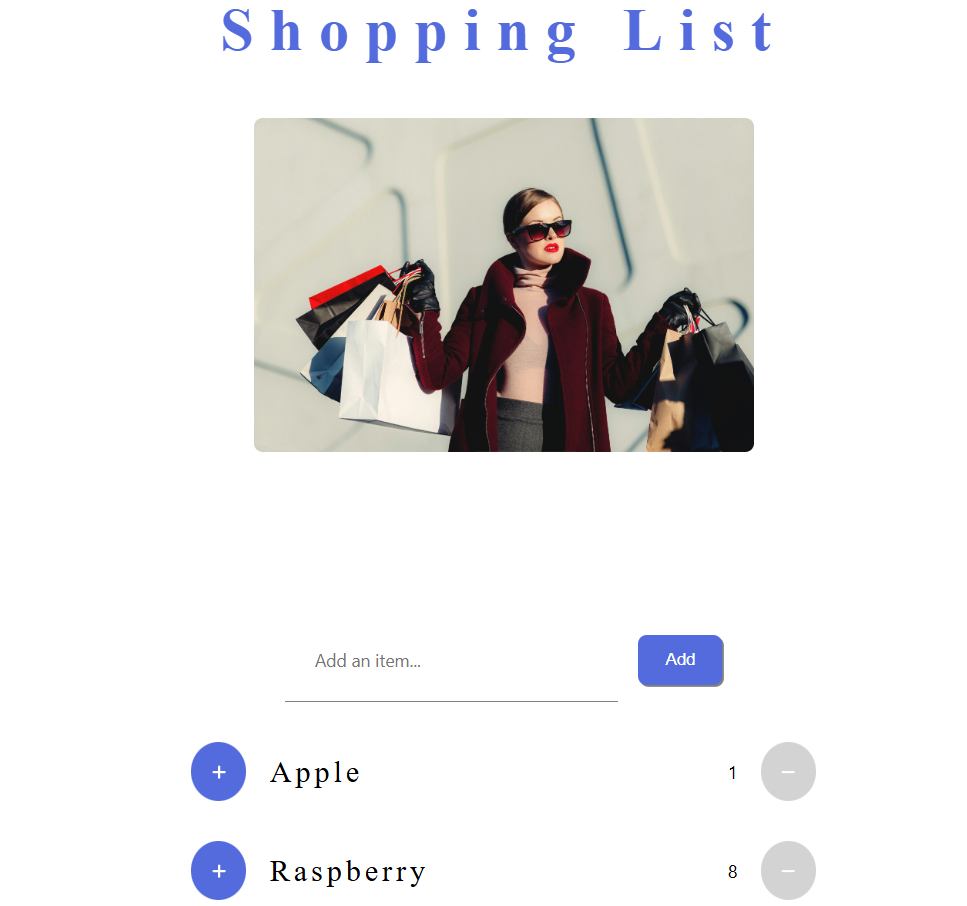

# Shopping List 🛒

A React-based shopping list app that allows users to add, edit, and delete items from a list. This project uses reducers for state management and includes modular components to make the app scalable and maintainable.



## Project Structure 📂

This app is organized into separate folders for assets, components, reducers, and utilities, following best practices for React application structure:

```
shoppinglist
│
├── .gitignore                 # Git ignore file
├── package-lock.json          # Lock file for dependencies
├── package.json               # Project metadata and dependencies
├── public
│   └── index.html             # HTML template
├── README.md                  # Project documentation
└── src
    ├── App.css                # Global app styles
    ├── App.js                 # Main app component
    ├── assets
    │   └── headerImage.jpg    # Image assets for the app
    ├── components             # Reusable UI components
    │   ├── Header             # Header component
    │   │   ├── Header.css     # Styles for Header
    │   │   └── Header.jsx     # Header component file
    │   ├── InputItem          # Input component for adding items
    │   │   ├── InputItem.css  # Styles for InputItem
    │   │   └── InputItem.jsx  # InputItem component file
    │   ├── Item               # Individual item component
    │   │   ├── Item.css       # Styles for Item
    │   │   └── Item.jsx       # Item component file
    │   ├── ItemList           # List component that holds multiple items
    │   │   ├── ItemList.css   # Styles for ItemList
    │   │   └── ItemList.jsx   # ItemList component file
    │   └── ShoppingList       # Main shopping list container
    │       ├── ShoppingList.css  # Styles for ShoppingList
    │       └── ShoppingList.jsx  # ShoppingList component file
    ├── index.css              # Global CSS styles
    ├── index.js               # Main entry point for React
    ├── reducers               # Reducers for state management
    │   └── itemReducer.js     # Reducer for managing items in the list
    └── utils                  # Utility functions
        └── showToasts.js      # Utility for displaying toast notifications
```

## Features 🌟

- **Add New Items**: Users can add items to their shopping list.
- **Edit and Delete Items**: Users can update or remove items as needed.
- **Dynamic State Management**: Uses React reducers to handle complex state transitions.
- **Toast Notifications**: Displays feedback messages for actions such as adding or deleting items.

## Code Snippets 🧩

### Reducer Example (itemReducer.js)

```javascript
function itemReducer(state, action) {
  switch (action.type) {
    case "ADD_ITEM":
      return [...state, action.payload];
    case "REMOVE_ITEM":
      return state.filter((item) => item.id !== action.payload.id);
    case "UPDATE_ITEM":
      return state.map((item) =>
        item.id === action.payload.id ? action.payload : item
      );
    default:
      return state;
  }
}
```

### Utility Function (showToasts.js)

```javascript
import { toast } from "react-toastify";

export function showToast(message, type) {
  toast[type](message);
}
```

## Installation ⚙️

1. **Clone the repository**:
   ```bash
   git clone https://github.com/iamrajanjharj/shoppinglist.git
   ```
2. **Navigate to the project directory**:
   ```bash
   cd shoppinglist
   ```
3. **Install dependencies**:
   ```bash
   npm install
   ```
4. **Run the app**:
   ```bash
   npm start
   ```

## Technologies Used 🛠️

- **React**: Core UI library for building the app.
- **React Reducers**: For managing the shopping list state.
- **React Toastify**: For in-app notifications.
- **CSS**: Custom styling for individual components.

## Contributing 🤝

Feel free to fork this project, submit issues, and make pull requests to improve the Shopping List app!

---

Enjoy managing your shopping list with ease! 😊
